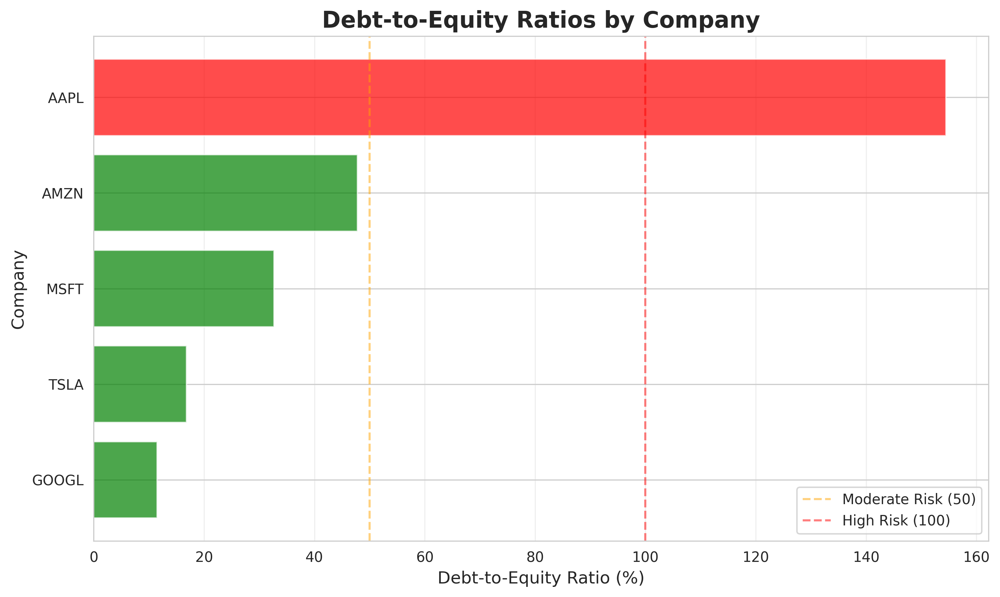
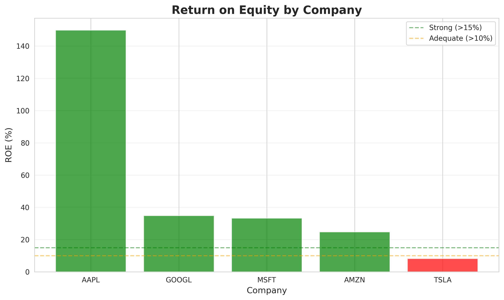
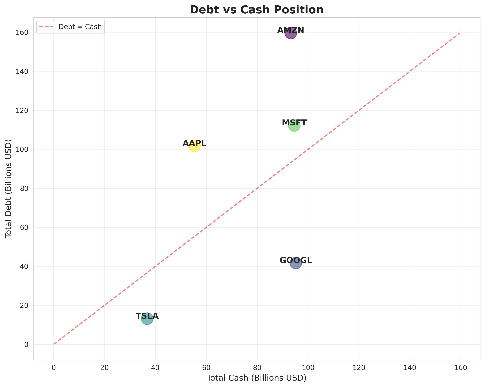

# Agentic Credit Risk Analysis System

AI-powered autonomous credit risk assessment platform using RAG, multi-agent workflows, and real-time market intelligence

**Tech Stack:** Python 3.10+ | LangChain | Groq | ChromaDB | Delta Lake

---

> **Note:** This is an educational/portfolio project demonstrating agentic AI concepts. It uses simplified credit rating methodology and is not intended for production financial decisions. Built as a learning exercise over a 1-day sprint.

---

## Project Overview

Agentic AI system that autonomously analyzes corporate credit risk by:

* Ingesting SEC 10-K filings and converting to searchable vector embeddings
* Deploying multi-agent workflows with RAG-powered semantic search
* Integrating real-time market data and recent financial news
* Generating standardized credit ratings with supporting evidence
* Storing structured results in Delta Lake lakehouse for querying

**Timeline:** 3-week intensive development sprint  
**Inspired by:** Moody's credit rating methodology (educational simplification)

## Key Results

### Credit Analysis Dashboard

  
**Debt-to-Equity Ratios** - Companies ranked by leverage: AAPL shows highest at 154%, GOOGL maintains conservative 11%

  
**Return on Equity** - AAPL leads at 149% ROE, demonstrating exceptional capital efficiency

  
**Liquidity Position** - Companies above diagonal carry more debt than cash

### Sample Analysis Output
```
Company: AAPL
Credit Rating: AA (Very Low Risk)
Debt-to-Equity: 154.5%
Return on Equity: 149%
Investment Grade: Yes

Company: GOOGL
Credit Rating: AA (Very Low Risk)
Debt-to-Equity: 11.5%
Return on Equity: 35%
Investment Grade: Yes

Company: TSLA
Credit Rating: A (Low Risk)
Debt-to-Equity: 16.8%
Return on Equity: 8%
Investment Grade: Yes
```

## System Architecture
```
┌─────────────┐     ┌──────────────┐     ┌─────────────┐     ┌──────────────┐
│  SEC EDGAR  │────▶│  RAG System  │────▶│   Agentic   │────▶│ Delta Lake   │
│  10-K Data  │     │  (ChromaDB)  │     │  Analysis   │     │  Lakehouse   │
└─────────────┘     └──────────────┘     └─────────────┘     └──────────────┘
                           │                     │                   │
                           │                     ▼                   │
                           │              ┌──────────────┐           │
                           │              │ Market Data  │           │
                           │              │ News Search  │           │
                           │              └──────────────┘           │
                           │                                         │
                           │                                         ▼
                           │                                 ┌──────────────┐
                           └────────────────────────────────▶│  Q&A Agent   │
                                                             │  (NL Query)  │
                                                             └──────────────┘
```

## Core Features

### 1. RAG-Powered Document Search

* **Vector Embeddings**: SEC 10-K filings chunked and embedded (all-MiniLM-L6-v2)
* **Semantic Retrieval**: ChromaDB enables similarity-based search
* **Specialized Queries**: Dedicated methods for risk factors, financials, debt analysis
* **Context Preservation**: 200-character overlap maintains continuity

### 2. Multi-Agent Workflows

* **Credit Analyst Agent**: Orchestrates 6-step analysis combining RAG + real-time data
* **Peer Comparison Agent**: Multi-company comparative analysis
* **Q&A Agent**: Natural language interface to lakehouse data
* **Tool Integration**: Market data (yfinance), news search (Tavily), calculators

### 3. Advanced Credit Metrics
```python
# Calculated Metrics
- Debt-to-Equity Ratio
- Return on Equity (ROE)
- Free Cash Flow
- Credit Rating (AAA, AA, A, BBB, BB, B, CCC)
- Investment Grade Classification
- Risk Level Assessment
```

### 4. Delta Lake Lakehouse

* **ACID Transactions**: Reliable data storage with transaction logs
* **Schema Evolution**: Add metrics without breaking queries
* **Time Travel**: Version history for auditing
* **Power BI Ready**: Connect via Parquet files or CSV export

### 5. Natural Language Q&A
```
User: "Which company has the highest debt-to-equity ratio?"
Agent: Generates SQL → Executes query → Returns: Apple at 154%

User: "Show me all companies with AA rating"
Agent: Filters data → Returns: AAPL, MSFT, GOOGL, AMZN
```

## Technology Stack

| Component | Technology | Purpose |
|-----------|-----------|---------|
| Agent Framework | LangChain + Groq | Multi-agent orchestration |
| LLM | Llama 3.3 70B (via Groq) | Credit analysis synthesis |
| Vector Database | ChromaDB | Semantic search over 10-Ks |
| Embeddings | sentence-transformers | Document vectorization |
| Lakehouse | Delta Lake | Structured data storage |
| Query Engine | DuckDB | SQL analytics on Parquet |
| Market Data | yfinance | Real-time stock/fundamentals |
| News API | Tavily | Recent financial news |
| Visualization | Matplotlib, Seaborn | Chart generation |
| Language | Python 3.10+ | Core implementation |

## Project Structure
```
agentic-credit-risk-analyzer/
├── src/
│   ├── data/
│   │   ├── sec_scraper.py           # SEC EDGAR downloader
│   │   ├── rag_system.py            # Vector database + retrieval
│   │   ├── lakehouse.py             # Delta Lake interface
│   │   └── generate_structured_output.py  # Analysis pipeline
│   ├── agent/
│   │   ├── rag_credit_agent.py      # Main credit analyst
│   │   ├── peer_comparison_agent.py # Multi-company analysis
│   │   └── lakehouse_qa_agent.py    # Natural language Q&A
│   ├── tools/
│   │   ├── market_data.py           # Real-time financial data
│   │   ├── news_search.py           # News API integration
│   │   └── financial_calculator.py  # Credit metrics
│   └── utils/
│       ├── credit_metrics.py        # Rating algorithms
│       └── visualizations.py        # Chart generation
├── data/
│   ├── raw/sec-edgar-filings/       # Downloaded 10-Ks
│   ├── chroma_db/                   # Vector embeddings
│   ├── lakehouse/credit_analysis/   # Delta Lake tables
│   └── processed/                   # CSV exports
├── outputs/
│   ├── charts/                      # Visualizations
│   └── *.json                       # Analysis reports
└── README.md
```

## Quick Start

### Prerequisites

* Python 3.10+
* 8GB+ RAM (for embeddings)
* Groq API key - **[Get free key here](https://console.groq.com/)**
* Tavily API key - **[Get free key here](https://tavily.com/)**

### Installation
```bash
# Clone repository
git clone https://github.com/yourusername/agentic-credit-risk-analyzer.git
cd agentic-credit-risk-analyzer

# Create virtual environment
python3 -m venv venv
source venv/bin/activate  # On Windows: venv\Scripts\activate

# Install dependencies
pip install chromadb sentence-transformers langchain langchain-groq
pip install sec-edgar-downloader yfinance tavily-python
pip install deltalake pandas duckdb matplotlib seaborn

# Configure API keys
cat > .env << EOF
GROQ_API_KEY=your_groq_api_key_here
TAVILY_API_KEY=your_tavily_api_key_here
EOF
```

**Important:** Before running the scraper, edit `src/data/sec_scraper.py` and replace `email@example.com` with your actual email address (required by SEC EDGAR).

### Usage

**1. Download SEC Filings**
```bash
python3 src/data/sec_scraper.py
# Downloads 10-K filings for 7 companies
```

**2. Build RAG Database**
```bash
python3 -m src.data.rag_system
# Creates vector embeddings (5-10 minutes)
```

**3. Run Credit Analysis**
```bash
# Single company
python3 -m src.agent.rag_credit_agent AAPL

# Peer comparison
python3 -m src.agent.peer_comparison_agent AAPL MSFT GOOGL

# Full pipeline (all companies)
python3 -m src.data.generate_structured_output
```

**4. Generate Visualizations**
```bash
python3 -m src.utils.visualizations
# Outputs saved to outputs/charts/
```

**5. Query Results**
```bash
python3 -m src.agent.lakehouse_qa_agent
# Interactive Q&A interface
```

## Use Cases

### For Learning/Portfolio Projects

* **Hands-on AI Practice**: Build production-style agentic systems
* **RAG Implementation**: Learn vector databases and semantic search
* **LLM Integration**: Practice prompt engineering with real use cases
* **Data Engineering**: Implement lakehouse architecture patterns

### Potential Enterprise Applications

With proper validation and regulatory compliance, similar systems could assist:

* Credit rating agencies with preliminary assessments
* Investment teams with due diligence screening
* Risk management with portfolio monitoring
* Financial analysts with peer comparisons

**Disclaimer:** Current implementation is educational and requires significant enhancements for production use.

## Demonstrated Skills

* Agentic AI system design with LangChain
* Retrieval-Augmented Generation (RAG) implementation
* Vector database design and semantic search
* Enterprise lakehouse architecture (Delta Lake)
* Credit risk modeling and financial analysis
* LLM prompt engineering and tool orchestration
* Production-ready data pipelines

## Technical Highlights

### Agentic Behavior Example
```
User: "Analyze Apple's credit risk"

Agent Self-Planning:
1. "Fetch real-time market data (stock price, debt, equity)"
2. "Search recent financial news (last 30 days)"
3. "Retrieve risk factors from 10-K via RAG"
4. "Retrieve financial performance sections"
5. "Retrieve debt and liquidity discussion"
6. "Synthesize all data into credit assessment"

Agent Execution:
→ Fetches AAPL market data from yfinance
→ Retrieves 5 recent news articles via Tavily
→ RAG queries ChromaDB for relevant 10-K chunks
→ Groq LLM synthesizes credit analysis
→ Extracts rating: AA (Very Low Risk)
→ Writes structured output to lakehouse
```

### Credit Rating Logic
```python
# Simplified rating methodology (educational)
if debt_to_equity < 30 and return_on_equity > 0.15:
    return "AAA"  # Minimal risk
elif debt_to_equity < 50 and return_on_equity > 0.10:
    return "AA"   # Very low risk
elif debt_to_equity < 100 and return_on_equity > 0.08:
    return "A"    # Low risk
elif debt_to_equity < 150:
    return "BBB"  # Moderate risk
else:
    return "BB"   # Substantial risk
```

## Key Learnings

* **RAG Architecture**: Vector search over 10-Ks dramatically improves context retrieval vs naive chunking
* **Agent Orchestration**: LangChain simplifies complex multi-step workflows with memory and tool calling
* **Lakehouse Benefits**: Delta Lake provides both analytical queries and transactional guarantees
* **Data Quality**: Real-time market data gaps (yfinance) require robust error handling
* **LLM Selection**: Groq's fast inference (100+ tok/s) enables interactive analysis workflows

## Limitations and Future Improvements

### Current Limitations

1. **Single Time Period**: Analysis based on most recent 10-K only, no historical trending
2. **Market Data Gaps**: yfinance returns incomplete data for some financial institutions
3. **Simplified Ratings**: Rules-based approach, not full Moody's quantitative model
4. **Limited Scale**: 7 companies analyzed; scalability untested beyond 50+
5. **Local Deployment**: Lakehouse runs locally; production requires cloud infrastructure
6. **Educational Purpose**: Not validated for actual financial decisions

### Potential Improvements

1. **Historical Analysis**: Download 3-5 years of 10-Ks to track debt ratio trends over time
2. **Advanced Models**: Implement Altman Z-Score, industry-specific adjustments
3. **Production Deployment**: Migrate to Microsoft Fabric or Databricks with Apache Airflow scheduling
4. **Additional Data**: Bond spreads, CDS prices, earnings call transcripts, analyst reports
5. **Multi-Agent Enhancements**: Sector-specific agents, adversarial validation, consensus mechanisms
6. **Web Interface**: Dashboard for interactive exploration with real-time updates
7. **Model Validation**: Backtest against actual credit ratings and default events

## Contributing

This is a portfolio/learning project. For questions or suggestions:

* Open an issue on GitHub
* Fork and submit pull requests
* Contact: krutjp26@gmail.com

## License

MIT License - See LICENSE file for details
